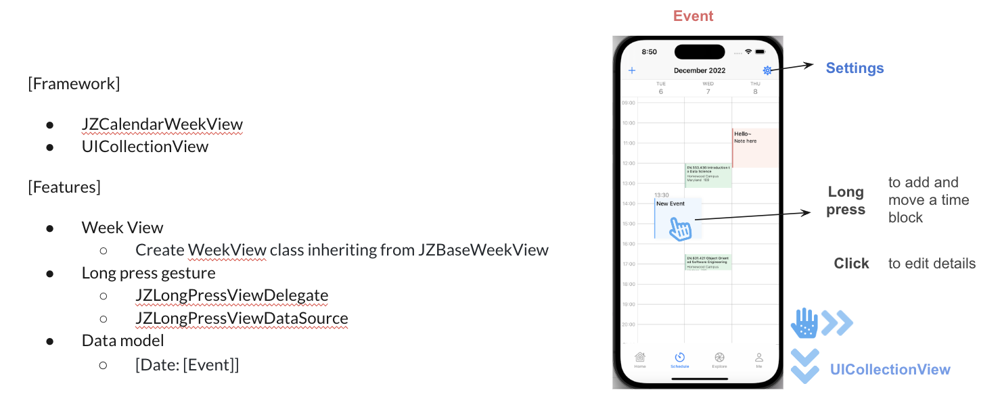

- Synchronized courses automatically from SIS of JHU to the embedded calendar using multi-threading and released an open-source package of customizable iOS calendar UI. [Github] (Swift, UIKit, Cocoa)
- Implemented real-time recommendations for on-campus activities with low latency (query time<18ms).

# Schedule

# Activity Filter

# Activity Collect

